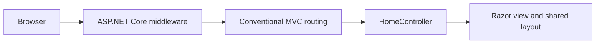

# 🎟️ eTicket — ASP.NET Core MVC Foundation

   

An ASP.NET Core MVC starting point for an eTicket/e-commerce application. The current repository establishes the web application structure, shared UI layout, routing, and error handling.

> [!NOTE]
> The repository name describes the intended e-commerce direction. The checked-in implementation is currently the MVC foundation; catalog, shopping cart, checkout, and payment features are not present yet.

## ✅ What is already in place?

- A solution containing the `eTicket` web project, targeting `net6.0`.
- MVC service registration and conventional controller/action routing.
- `HomeController` with Index, Privacy, and Error actions.
- Razor views with shared layout and validation-script partials.
- Bundled Bootstrap, jQuery, and jQuery validation assets.
- Static-file serving and HTTPS redirection.
- Non-development exception handling and HSTS middleware.
- An error view model exposing the request ID for troubleshooting.
- Local launch profiles for the project and IIS Express.

## 🚀 Run locally

Use an SDK capable of building `net6.0` and the matching ASP.NET Core runtime. The project targets an older framework; review and update the target before a new production deployment.

```sh
git clone https://github.com/sa5ra2000/Complete-Ecommerce-Aspnet-Mvc-Application.git
cd Complete-Ecommerce-Aspnet-Mvc-Application
dotnet restore eTicket.sln
dotnet build eTicket.sln
dotnet run --project eTicket/eTicket.csproj --launch-profile eTicket
```

The checked-in project profile uses `https://localhost:7168` and `http://localhost:5168`. HTTP requests are redirected to HTTPS; local HTTPS requires a trusted development certificate. Follow the address printed by the application.

You can also open `eTicket.sln` in Visual Studio with ASP.NET/web development support.

## 🧩 Repository layout

```text
eTicket.sln
eTicket/
  Program.cs                   # Services and request pipeline
  Controllers/HomeController.cs
  Models/ErrorViewModel.cs
  Views/Home/                  # Index and Privacy
  Views/Shared/                # Layout, error, validation scripts
  wwwroot/                     # CSS, JavaScript, vendor assets
  Properties/launchSettings.json
  appsettings.json
```



## 📍 Current progress

- [x] Create the ASP.NET Core MVC solution.
- [x] Establish the default routes, views, layout, and error path.
- [x] Add local run profiles and static UI assets.
- [ ] Define ticket/product, cinema, customer, and order models.
- [ ] Add database persistence and migrations.
- [ ] Build catalog browsing and administration.
- [ ] Add cart, checkout, and payment integration.
- [ ] Add authentication, authorization, and automated tests.

Unchecked items describe a possible development roadmap, not existing functionality. No database provider, EF Core package, authentication setup, or test project is included in the current source. `UseAuthorization()` alone does not implement sign-in or access policies.

## 🔍 Validation scope

This README describes the checked-in application structure. Build and runtime commands are provided for local use; they were not executed as part of this documentation-only update.
